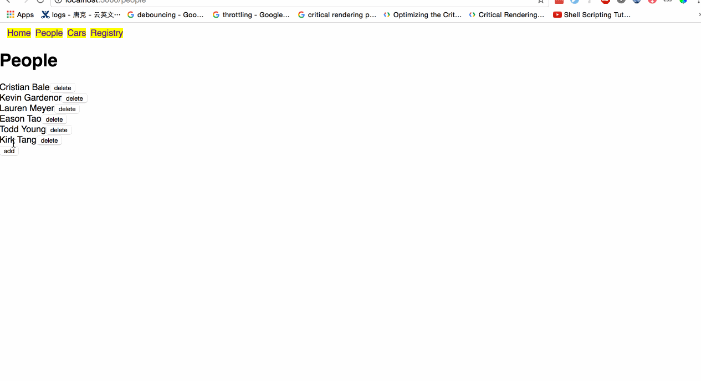

# Tech stack

    - Data layer
    |
    +---- MongoDB
    |
    - RESTful API layer
    |
    +---- Node.js
    +---- express
    |
    - Front-end
    |
    +---- React.js
    +---- redux
    +---- react-router-dom

# How to run?
- `cd server/; mkdir mongodb/; yarn`
    - you do this once
- `cd client/; yarn`
    - you do this once
- `cd server/; yarn run mongo`
    - this runs MongoDB
- `cd server/; yarn start`
    - this runs node server
- `cd client/; yarn start`
    - this runs React dev server
- open up `localhost:3000` in your browser

# Demo

